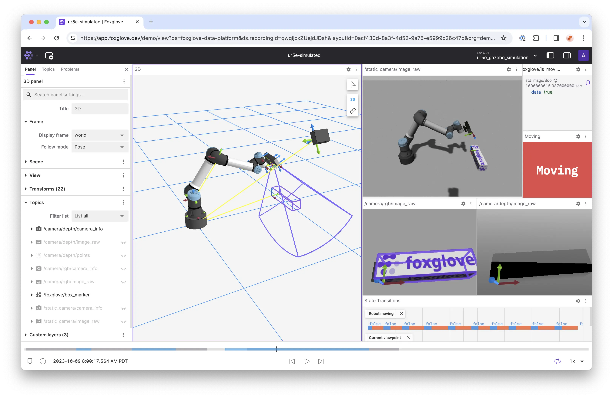

Foxglove's mission is to increase the GDP of robotics. We build commercial and open source software to help robotics developers get to market faster and scale to millions of units.

- [**Foxglove**](https://foxglove.dev) is our flagship visualization and observability platform for multimodal data.

- [**MCAP**](https://mcap.dev) is an open source file format for multimodal data.
